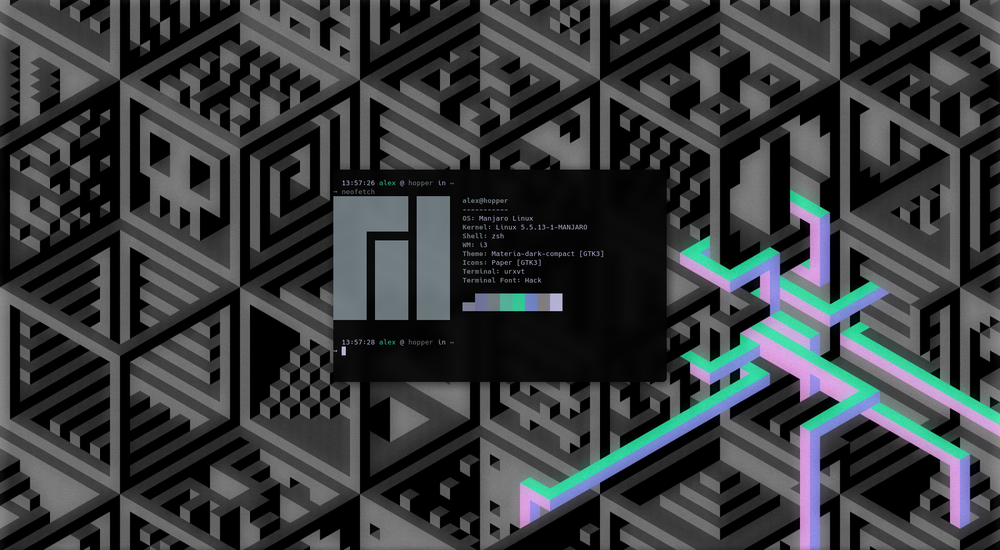

```
			██████╗  ██████╗ ████████╗███████╗██╗██╗     ███████╗███████╗
     			██╔══██╗██╔═══██╗╚══██╔══╝██╔════╝██║██║     ██╔════╝██╔════╝
     			██║  ██║██║   ██║   ██║   █████╗  ██║██║     █████╗  ███████╗
     			██║  ██║██║   ██║   ██║   ██╔══╝  ██║██║     ██╔══╝  ╚════██║
     			██████╔╝╚██████╔╝   ██║   ██║     ██║███████╗███████╗███████║
    			╚═════╝  ╚═════╝    ╚═╝   ╚═╝     ╚═╝╚══════╝╚══════╝╚══════╝
```                                                          

The dotfiles I use to customize my Linux setup. Includes files for i3, urxvt, zsh, vim, tmux, rofi, Firefox



## Technical Information
```
     Distro: Manjaro 19.0.2 Kyria
   Terminal: kitty
      Shell: zsh + Oh-My-Zsh
         WM: i3-gaps-rounded
      Icons: Paper (snwh.org/paper)
  GTK Theme: Materia-Dark-Compact (github.com/nana-4/materia-theme)
    Browser: Firefox
     Editor: Vim + Atom
       Font: Hack
```
